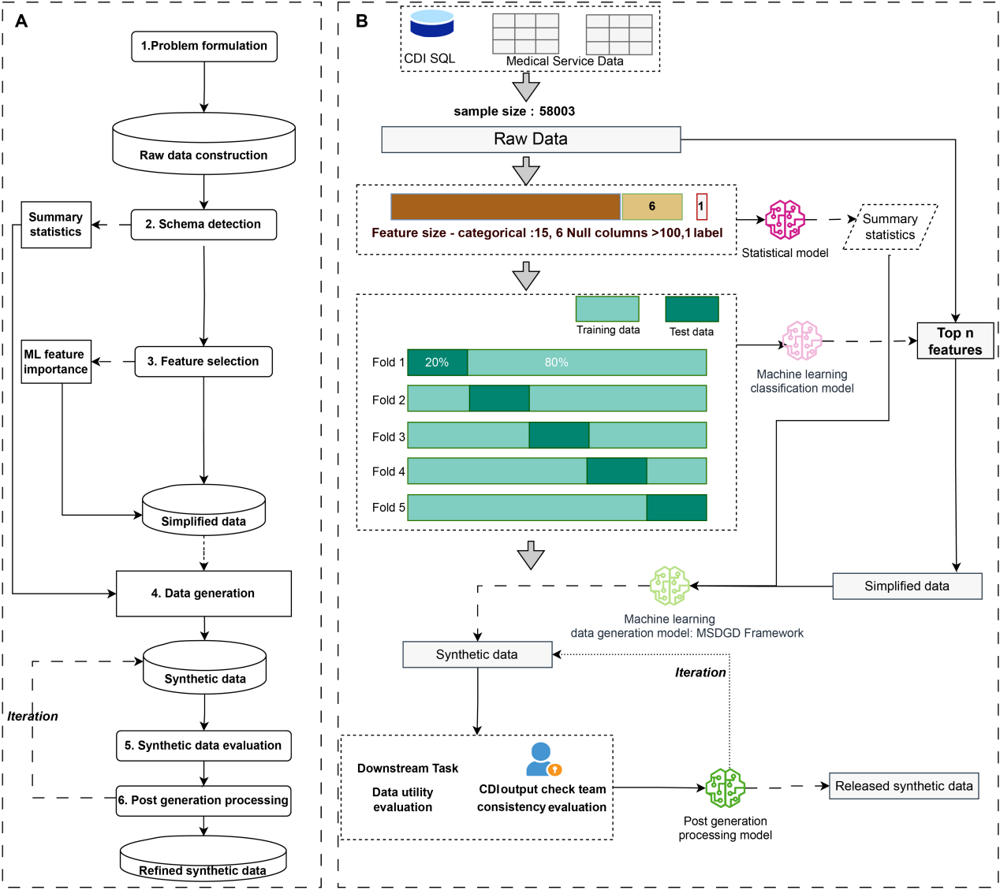
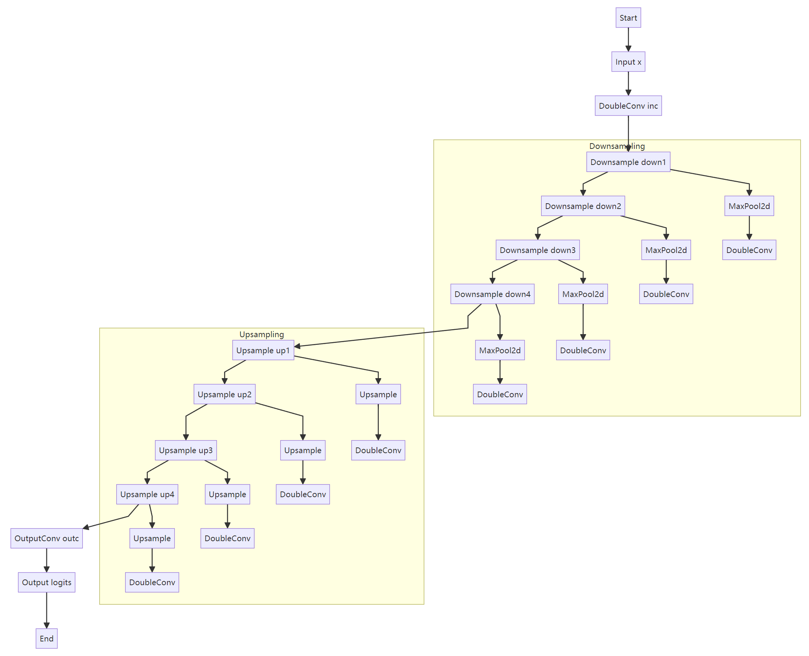

# A novel Gaussian diffusion-based MSD generation framework, MSDGD.
Install dependencies:

1. It is recommended to install the dependencies in a conda environment.
2. Install [PyTorch](https://pytorch.org/), [PyTorch Geometric](https://pytorch-geometric.readthedocs.io/en/latest/), [`pytorch-lightning`](https://www.pytorchlightning.ai/index.html).

Run the example:

```bash
# Make gmm importable
export PYTHONPATH=$PWD

# Enter the `examples` directory
cd examples

# Run the training script
python train.py

# Test model performance
python test.py
```


## Feature Engineering Flowchart


## Code Flowchart




## Run the code


method_list = [
    "Diffusion_MLP_Intern", 
    "Diffusion_MLP_Entire",
    "Diffusion_MLP_ParentChild", 
    "RamCol_MLP_Intern", 
    "RamCol_MLP_Entire", 
    "RamCol_MLP_ParentChild",
    
    "RamCol_1_Unet_ParentChild",
    "RamCol_2_Unet_ParentChild",
    "DimTrans_Unet_Intern", 
    "DimTrans_Unet_Entire", 
    "DimTrans_Unet_ParentChild",
    "RamCol+DimTrans_Unet_Intern", 
    "RamCol+DimTrans_Unet_Entire",
    "RamCol+DimTrans_Unet_ParentChild"]


- Diffusion_MLP_Intern
- Diffusion_MLP_Entire
- Diffusion_Transformer_Intern
- Diffusion_Transformer_Entire

- RamCol_MLP_Intern
- RamCol_Transformer_Intern

- DimTrans_Unet_Intern
- DimTrans_Unet_Entire
- DimTrans_Unet_ParentChild

- RamCol+DimTrans_Unet_Intern
- RamCol+DimTrans_Unet_Entire
- RamCol+DimTrans_Unet_ParentChild

##### 方法
Baseline 基础扩散
RamCol 随机列排序  
DimTrans 维度转换
RamCol+DimTrans 随机列排序+维度转换

##### 神经网络模型
MLP
Transformer
Unet

##### 数据编码方式
InternEncoder
EntireEncoder
ParentChildEncoder

InternEncoder_Inverse
EntireEncoder_Inverse
ParentChildEncoder_Inverse

Table 1: InternEncoder & EntireEncoder
Table 2: InternEncoder_Inverse & EntireEncoder_Inverse


新开后台任务
```cmd
Screen 创建新窗口
输入你想要的运行的内容
Ctrl-a d 先按 ctrl+a，再按 d,此时你可以关闭连接了，做自己想做的事情去，再次回来时通过下面操作可以看到程序一直在运行。
Screen -ls 查看当前有哪些会话，并显示 id
Screen -r id 恢复会话
```
环境创建
```cmd
conda create -n simdiff python=3.11
conda activate simdiff
conda install pytorch  pytorch-cuda=12.1 -c pytorch -c nvidia
export CUDA_VISIBLE_DEVICES=0,1
```

安装依赖：`pip install sdv xlrd statsmodels jupyter -i https://pypi.tuna.tsinghua.edu.cn/simple some-package`
自动提取依赖： `pip freeze > requirements.txt`

局域网运行jupyter notebook
```cmd
jupyter-lab password 输入密码
jupyter notebook --generate-config 生成配置文件，增加以下内容

c.ServerApp.ip = '0.0.0.0'
c.ServerApp.open_browser = False
c.ServerApp.port = 8888
c.ServerApp.allow_remote_access = True

jupyter notebook 启动，远程登录密码是刚才输入的
```
注意：在jupyter中修改完配置参数后，要重启kernel才能生效。

---


